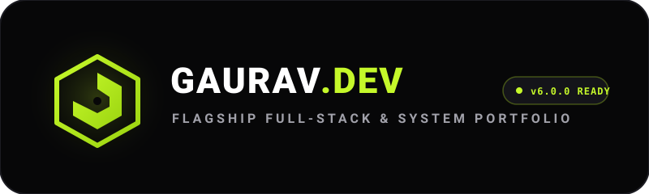

<div align="center">

  

  <br />
  <br />

  [](https://ggauravky.vercel.app/)
  [](LICENSE)
  [](https://react.dev/)
  [](https://vitejs.dev/)
  [](https://tailwindcss.com/)
  [](https://nodejs.org/)

  <br />

  [](https://ggauravky.vercel.app/)
  [](https://github.com/ggauravky)
  [](https://www.linkedin.com/in/gauravky/)
  [](https://www.instagram.com/the_gau_rav/)
  [](mailto:kumar.gaurav.yadav2007@gmail.com)

  <br />

  **A flagship software engineering portfolio, interactive system showcase, and production web application.**

  [Live Portfolio Demo](https://ggauravky.vercel.app/) · [Admin Portal](https://ggauravkyadmin.vercel.app/admin/login) · [System Architecture](docs/ARCHITECTURE.md) · [Deployment Guide](docs/DEPLOYMENT.md)

</div>

---

## 📑 Table of Contents

- [Overview & Philosophy](#-overview--philosophy)
- [Key Features & Architecture](#-key-features--architecture)
- [Tech Stack](#-tech-stack)
- [Repository Structure](#-repository-structure)
- [Getting Started](#-getting-started)
- [Environment Variables](#-environment-variables)
- [Build & Performance Metrics](#-build--performance-metrics)
- [Deployment](#-deployment)
- [Frequently Asked Questions](#-frequently-asked-questions)
- [Community & Governance](#-community--governance)
- [License & Acknowledgements](#-license--acknowledgements)
- [Author & Contact](#-author--contact)

---

## 💡 Overview & Philosophy

**Dev-Portfolio** is an engineering portfolio crafted to demonstrate modern web standards, systems architecture, high-performance rendering, and design engineering principles.

Inspired by the design aesthetics of Vercel, Linear, Apple, and Stripe, the codebase emphasizes:

1. **Obsidian Visual Hierarchy**: Pure `#070708` dark theme, glassmorphic backdrop blurs, and `#c5f82a` toxic accent contrast.
2. **Sub-Second Rendering**: Code-split route chunks, Rollup manual chunking, and automated AVIF/WebP image variants ($402$ files generated at build).
3. **Universal Accessibility (WCAG AA+)**: Full keyboard navigation, visible focus rings, ARIA roles, and responsive scaling across 10 viewports ($320\text{px}$ to $3840\text{px}$).
4. **End-to-End Reliability**: Integrated Express backend API, MongoDB Atlas persistence, and Cashfree gateway payment flows.

---

## 🚀 Key Features & Architecture

### ⚡ Spotlight Features

- **Universal Command Center (`⌘K`)**: Raycast-grade instant fuzzy search across all portfolio pages, project case studies, and services.
- **Interactive Radial Navigation**: Contextual mouse radial navigation menu offering shortcuts to projects, resume, GitHub, and contact channels.
- **Interactive Career Journey**: Filterable timeline of academic and engineering milestones with real-time multi-attribute filtering.
- **Service Booking & Payments**: Production integration with Cashfree for 1-on-1 mentorship bookings, code reviews, and project estimates.
- **Admin Management Portal**: Administrative portal for transaction verification, booking approvals, and activity history.

### 📐 System Architecture Diagram

```
                              ┌────────────────────────────────────────┐
                              │            VISITOR BROWSER             │
                              │  Vite + React 18 SPA | Tailwind CSS    │
                              └───────────────────┬────────────────────┘
                                                  │
                                        HTTPS / REST API Calls
                                                  │
                              ┌───────────────────▼────────────────────┐
                              │            NODE.JS BACKEND             │
                              │    Express, Cors, Helmet, Pino Logs    │
                              └─────────┬───────────────────┬──────────┘
                                        │                   │
                              ┌─────────▼────────┐  ┌───────▼────────┐
                              │     MONGODB      │  │ CASHFREE API   │
                              │   (Atlas DB)     │  │  (Checkout)    │
                              └──────────────────┘  └────────────────┘
```

---

## 🛠 Tech Stack

| Layer | Technology | Usage / Purpose |
| :--- | :--- | :--- |
| **Frontend Core** | [React 18](https://react.dev/) | Component architecture, Concurrent rendering, Hooks |
| **Build Engine** | [Vite 5](https://vitejs.dev/) | HMR, Rollup bundling, code splitting |
| **Styling** | [Tailwind CSS 3](https://tailwindcss.com/) | Utility-first styling, Obsidian theme tokens |
| **Animations** | [Framer Motion 12](https://framer.com/motion) | Layout animations, page transitions, spring physics |
| **Icons** | [Lucide React](https://lucide.dev/) | Clean vector SVG icon suite |
| **Backend API** | [Node.js](https://nodejs.org/) & [Express](https://expressjs.com/) | RESTful API server, payment webhooks, middleware |
| **Database** | [MongoDB Atlas](https://www.mongodb.com/atlas) | Document store for transactions, sessions, & records |
| **Payment Gateway** | [Cashfree SDK](https://www.cashfree.com/) | Direct Indian UPI / NetBanking / Card payments |

---

## 📂 Repository Structure

```
dev-portfolio/
├── assets/
│   └── github/                # SVG Logos, Monochrome variants, and Favicon
├── backend/
│   ├── config/                # Database & environment configurations
│   ├── controllers/           # API request controllers (Auth, Payment, Contact)
│   ├── models/                # Mongoose database schemas
│   ├── routes/                # Express API route declarations
│   └── server.js              # Node.js Express server entrypoint
├── docs/                      # Technical Architecture, Deployment & FAQ documentation
├── public/                    # Static public assets, favicon, & generated sitemap.xml
├── scripts/                   # Image variant generator & sitemap script
├── src/
│   ├── components/            # Shared UI components (Navbar, Footer, CommandPalette)
│   ├── context/               # React Context Providers (OpeningContext)
│   ├── data/                  # Portfolio data stores (projectsData, blogsData, journeyData)
│   ├── hooks/                 # Custom React hooks (useAuth, useSEO, use3DTilt)
│   ├── pages/                 # Main page components (Home, About, Journey, Projects...)
│   └── App.jsx                # Application root & React Router configuration
└── package.json               # Root package dependencies & scripts
```

---

## 🏁 Getting Started

### Prerequisites

- **Node.js**: `v20.0.0` or higher
- **npm**: `v10.0.0` or higher

### 1. Clone & Install

```bash
git clone https://github.com/ggauravky/Dev-Portfolio.git
cd Dev-Portfolio
npm install
```

### 2. Configure Environment Variables

Create `.env.local` in the project root:

```env
VITE_API_URL=http://localhost:5000/api
```

Create `.env` in the `backend/` directory:

```env
PORT=5000
NODE_ENV=development
MONGODB_URI=mongodb+srv://<user>:<password>@cluster.mongodb.net/dev-portfolio
FRONTEND_URL=http://localhost:5173
CASHFREE_APP_ID=your_cashfree_app_id
CASHFREE_SECRET_KEY=your_cashfree_secret_key
```

### 3. Run Locally

```bash
# Terminal 1 — Launch Frontend Dev Server
npm run dev

# Terminal 2 — Launch Backend Server
cd backend
npm run dev
```

Visit `http://localhost:5173` in your browser.

---

## 📊 Build & Performance Metrics

Dev-Portfolio uses sharp image variant generation and automated sitemap creation during build.

<details>
<summary><b>🔍 View Build Verification Output</b></summary>

```
Responsive image variant generation complete. Files created: 402
✅ Sitemap generated successfully!
📍 Location: public/sitemap.xml
📊 Total URLs: 54
   - Static pages: 22
   - Blog posts: 7
   - Project pages: 25
vite v5.4.21 building for production...
✓ 2,336 modules transformed.
✓ built in 52.07s
```

</details>

---

## 🚢 Deployment

The portfolio is deployed using **Vercel**:

1. **Frontend**: Deployed directly from GitHub main branch on Vercel (`ggauravky.vercel.app`).
2. **Backend**: Deployed on Vercel Serverless / Node.js runtime.
3. **Database**: MongoDB Atlas cloud cluster with SRV connection strings.

See the full [Deployment Guide](docs/DEPLOYMENT.md) for detailed instructions.

---

## 🤝 Community & Governance

We maintain an active open-source policy:

- 📖 [Contributing Guide](CONTRIBUTING.md) — Learn how to submit pull requests and propose updates.
- 📜 [Code of Conduct](CODE_OF_CONDUCT.md) — Contributor Covenant standard.
- 🔒 [Security Policy](SECURITY.md) — Vulnerability disclosure procedure.
- 💬 [Support & Help](SUPPORT.md) — Questions and contact channels.

---

## 📄 License & Acknowledgements

Distributed under the **MIT License**. See [`LICENSE`](LICENSE) for details. Third-party software credits are documented in [`NOTICE.md`](NOTICE.md).

---

## ✉️ Author & Contact

**Gaurav Kumar Yadav**  
*AI/ML Developer & Web Developer*  
BCA Student at BBD University (BBDU), Lucknow, Uttar Pradesh, India

- 🌐 **Website**: [ggauravky.vercel.app](https://ggauravky.vercel.app/)
- 📧 **Email**: [kumar.gaurav.yadav2007@gmail.com](mailto:kumar.gaurav.yadav2007@gmail.com)
- 💼 **LinkedIn**: [linkedin.com/in/gauravky](https://www.linkedin.com/in/gauravky/)
- 📷 **Instagram**: [@the_gau_rav](https://www.instagram.com/the_gau_rav/)
- 📞 **Phone**: +91 8542036499

---

<div align="center">
  <sub>Designed &amp; Developed with ❤️ by Gaurav Kumar Yadav · © 2026</sub>
</div>
