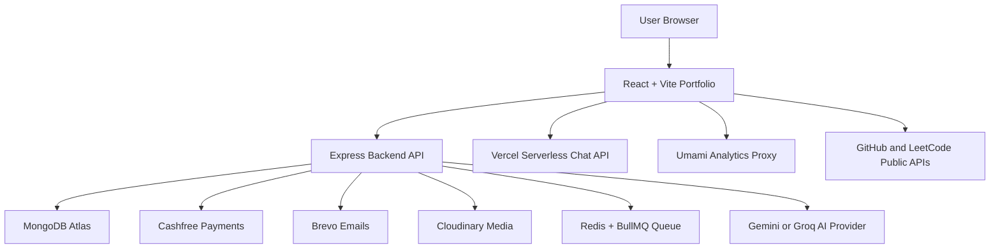

<div align="center">
  

  <h1>Gaurav Kumar Yadav - Developer Portfolio</h1>

  <p>
    A production-ready personal portfolio, service booking platform, AI chatbot, blog system,
    project showcase, support/payment flow, and authenticated user activity dashboard.
  </p>

  <p>
    <a href="https://ggauravky.vercel.app"><strong>Live Portfolio</strong></a>
    |
    <a href="https://ggauravkyadmin.vercel.app"><strong>Admin Panel</strong></a>
    |
    <a href="https://dev-portfolio-ojfs.onrender.com"><strong>Backend API</strong></a>
  </p>
</div>

<div align="center">


</div>

---

## Table of Contents

- [What This Project Is](#what-this-project-is)
- [Live Links](#live-links)
- [Core Highlights](#core-highlights)
- [Pages and Routes](#pages-and-routes)
- [Services Offered](#services-offered)
- [Project Showcase](#project-showcase)
- [Blog and Updates](#blog-and-updates)
- [Tech Stack](#tech-stack)
- [System Architecture](#system-architecture)
- [Backend API](#backend-api)
- [Local Development](#local-development)
- [Environment Variables](#environment-variables)
- [Build Pipeline](#build-pipeline)
- [Deployment](#deployment)
- [Security and Privacy](#security-and-privacy)
- [Repository Structure](#repository-structure)
- [Key Files](#key-files)
- [Legacy User Link Backfill](#legacy-user-link-backfill)
- [Documentation and Policies](#documentation-and-policies)
- [License](#license)

## What This Project Is

This repository is the main production portfolio for **Gaurav Kumar Yadav**.
It is not only a static resume website. It works like a complete product system:

- A modern portfolio for skills, projects, blogs, services, and contact.
- A service booking flow with Google sign-in and Cashfree payments.
- A support/contribution flow with receipts and activity history.
- An AI assistant that can answer questions about Gaurav, his projects, and tech topics.
- A lab area with ML demos, GitHub/LeetCode stats, and consistency dashboards.
- A secure Express backend with MongoDB models, validation, rate limits, emails, and payment reconciliation.
- A build pipeline for image optimization, sitemap generation, and production bundles.

## Live Links

| Area | URL | Purpose |
| --- | --- | --- |
| Portfolio | [ggauravky.vercel.app](https://ggauravky.vercel.app) | Main public website |
| Admin Panel | [ggauravkyadmin.vercel.app](https://ggauravkyadmin.vercel.app) | Separate dashboard for backend data |
| Backend API | [dev-portfolio-ojfs.onrender.com](https://dev-portfolio-ojfs.onrender.com) | Express API hosted on Render |
| GitHub | [github.com/ggauravky](https://github.com/ggauravky) | Public repositories and proof of work |
| LinkedIn | [linkedin.com/in/ggauravky](https://linkedin.com/in/ggauravky) | Professional profile |

## Core Highlights

- **Production frontend**: React, Vite, Tailwind, Framer Motion, route-level lazy loading.
- **Portfolio content engine**: central data files for projects, blogs, services, and events.
- **AI chatbot**: Gemini or Groq provider support, conversation history, privacy-safe analytics.
- **Service marketplace**: service pages, booking form, checkout, payment verification, receipts.
- **Google authentication**: secure cookie session, profile page, logout, welcome emails.
- **Payment reliability**: Cashfree orders, webhook verification, duplicate webhook protection, reconciliation retries.
- **Support system**: blog support button, support counts, support history, support payments.
- **User activity timeline**: login, payment, receipt, and support events in one private area.
- **ML lab**: image analyzer, prompt improver, usage logging, Cloudinary uploads.
- **SEO system**: canonical tags, Open Graph, Twitter metadata, JSON-LD, robots, sitemap.
- **Image performance**: AVIF/WebP/original variants generated with Sharp.
- **Security baseline**: Helmet, CORS allowlist, rate limiting, validators, mongo sanitize, admin keys.
- **Observability**: Pino request logs, request IDs, optional Sentry, Umami analytics proxy.

## Pages and Routes

### Main Portfolio Pages

| Route | Page | Simple Purpose |
| --- | --- | --- |
| `/` | Home | First impression, intro, highlights, featured work |
| `/about` | About | Education, story, background, career direction |
| `/skills` | Skills | Technical skills and tool categories |
| `/projects` | Projects | Filterable project showcase |
| `/projects/:slug` | Project Detail | Deep explanation of one project |
| `/blog` | Blog | Articles about AI, cybersecurity, coding, and career |
| `/blog/:slug` | Blog Post | Full article page with support actions |
| `/updates` | Updates | Event records and learning updates |
| `/contact` | Contact | Contact form and communication links |
| `/admin` | Admin Redirect | Sends admin users to the separate admin panel |
| `*` | Not Found | Custom 404 page |

### Service and Booking Pages

| Route | Page | Simple Purpose |
| --- | --- | --- |
| `/services` | Services | All current service offerings |
| `/services/:slug` | Service Detail | Dynamic detail page for each service |
| `/booknow` | Book Now | Booking entry point |
| `/mentorship` | Mentorship | Direct service shortcut |
| `/resume-review` | Resume Review | Direct service shortcut |
| `/debugging-help` | Debugging Help | Direct service shortcut |
| `/portfolio-review` | Portfolio Review | Direct service shortcut |
| `/frontend-development` | Frontend Development | Direct service shortcut |
| `/backend-development` | Backend Development | Direct service shortcut |
| `/full-stack-development` | Full Stack Development | Direct service shortcut |
| `/ai-data-science-guidance` | AI / Data Science Guidance | Direct service shortcut |

### Account, Payment, and Support Pages

| Route | Page | Simple Purpose |
| --- | --- | --- |
| `/support` | Support | Support/contribution flow |
| `/payment-success` | Payment Success | Payment result without transaction id |
| `/payment-success/:transactionId` | Payment Success | Payment result with transaction lookup |
| `/payment-under-construction` | Payment Under Construction | Fallback page when gateway is disabled |
| `/my-activity` | My Activity | Private activity timeline |
| `/my-supports` | My Supports | Private list of supported blog posts/payments |

### Lab and Experiment Pages

| Route | Page | Simple Purpose |
| --- | --- | --- |
| `/lab` | Lab | Hub for experiments and developer tools |
| `/lab/gaurav-chatbot` | Gaurav Chatbot | Full-screen AI assistant experience |
| `/lab/ml-demos` | ML Demos | Placeholder for ML demo expansion |
| `/lab/consistency-dashboard` | Consistency Dashboard | GitHub/LeetCode/learning consistency view |

### Legal Pages

| Route | Page | Simple Purpose |
| --- | --- | --- |
| `/privacy` | Privacy | Privacy policy |
| `/terms` | Terms | Terms and conditions |
| `/refund` | Refund | Refund and cancellation policy |

## Services Offered

All service data lives in [src/data/servicesData.js](src/data/servicesData.js), so the UI and README describe the same catalog.

| Service | Route | Price | Delivery | What It Solves |
| --- | --- | --- | --- | --- |
| Mentorship | `/mentorship` | INR 49 | 24-48 hours | Gives a clear roadmap, weekly plan, and learning direction |
| Resume Review | `/resume-review` | INR 99 | 24 hours | Improves ATS readability, project bullets, and role fit |
| Debugging Help | `/debugging-help` | INR 99 | Same day in most cases | Finds root cause and gives a clean fix path |
| Portfolio Review | `/portfolio-review` | INR 99 | 24-48 hours | Improves UI, story, trust, and recruiter/client clarity |
| Frontend Development | `/frontend-development` | INR 1499 - INR 1999 | 3-5 days | Builds responsive React/Tailwind frontend modules |
| Backend Development | `/backend-development` | INR 1499 - INR 1999 | 3-6 days | Builds APIs, models, validation, logging, and secure backend flow |
| Full Stack Development | `/full-stack-development` | INR 3499 - INR 3999 | Milestone based | Delivers frontend, backend, auth, integration, and deployment support |
| AI / Data Science Guidance | `/ai-data-science-guidance` | INR 499 - INR 999 | Within 48 hours | Helps with ML project framing, experiments, metrics, and roadmap |

### Service Flow

1. User signs in with Google.
2. User chooses a service.
3. Backend creates a Cashfree order.
4. Cashfree checkout runs in the browser.
5. Backend verifies the payment and reconciles it with Cashfree.
6. User can view booking status in **My Activity**.
7. Paid users can download PDF/SVG receipts.
8. Email receipts are sent through Brevo when configured.

## Project Showcase

The portfolio currently contains **18 projects** across full stack, AI/ML, frontend, and Python.
Featured projects are shown more strongly in the UI.

### Featured Projects

| Project | Category | Tech | Links |
| --- | --- | --- | --- |
| SmartMess | Full Stack | React, Node.js, Express, MongoDB, JWT, Vercel | [Demo](https://smartmesslms.vercel.app/) / [Code](https://github.com/ggauravky/SmartMess) |
| Dev Portfolio Admin Panel | Full Stack | React, Node.js, Express, MongoDB, JWT, Tailwind CSS | [Demo](https://ggauravkyadmin.vercel.app) / [Code](https://github.com/ggauravky/Dev-Portfolio-Admin-Panel) |
| Real-Time Chat App | Full Stack | React, Node.js, Socket.IO, MongoDB, JWT, Cloudinary | [Demo](https://chat-app-6ly8.onrender.com/) / [Code](https://github.com/ggauravky/chat-app) |
| BuildMyTeam | Full Stack | React, Node.js, Express, MongoDB, JWT, Tailwind CSS, TanStack Query, Zod | [Demo](https://buildmyteam.vercel.app/) / [Code](https://github.com/ggauravky/BuildMyTeam) |
| FocusGuard | AI/ML, Python | Python, OpenCV, YOLOv4-tiny, NumPy, Computer Vision | [Code](https://github.com/ggauravky/FocusGuard) |
| TrueCert | Full Stack | React, Node.js, Express, MongoDB, JWT, Cloudinary, QR Code | [Code](https://github.com/ggauravky/TrueCert) |
| Fire Detection Alert System | AI/ML, Python | Python, OpenCV, NumPy, Pygame, pyttsx3 | [Code](https://github.com/ggauravky/fire-detection-alert-system) |

### Full Project Catalog

| Project | Type | Main Tech |
| --- | --- | --- |
| SmartMess | Full Stack | React, Node.js, Express, MongoDB, JWT |
| Dev Portfolio Admin Panel | Full Stack | React, Node.js, Express, MongoDB, Tailwind CSS |
| Real-Time Chat App | Full Stack | React, Node.js, Socket.IO, MongoDB, Cloudinary |
| MERN Product Store | Full Stack | React, Node.js, MongoDB, Express, Chakra UI |
| Notes App | Full Stack | React, Node.js, Express, MongoDB, REST API |
| AIReel Studio | Python, AI/ML | Python, Flask, ffmpeg, ElevenLabs API |
| Glass-Morphism Calculator | Frontend | HTML5, CSS3, JavaScript |
| Custom CAPTCHA Generator | Frontend | HTML5, CSS3, JavaScript, FontAwesome |
| TaskMaster Pro | Frontend | HTML5, CSS3, JavaScript, Local Storage |
| Flappy Bird Game | Frontend | HTML5, CSS3, JavaScript, Canvas API |
| PDF to Audio Book | Python | Python, PyPDF2, pyttsx3, gTTS |
| ShopEase | Frontend | HTML5, CSS3, JavaScript |
| DishDash | Frontend | HTML5, CSS3, JavaScript |
| Python Grocery Store Application | Full Stack, Python | Python, Flask, MySQL, HTML5, CSS3, JavaScript |
| BuildMyTeam | Full Stack | React, Node.js, Express, MongoDB, TanStack Query, Zod |
| FocusGuard | AI/ML, Python | Python, OpenCV, YOLOv4-tiny, NumPy |
| TrueCert | Full Stack | React, Node.js, Express, MongoDB, QR Code |
| Fire Detection Alert System | AI/ML, Python | Python, OpenCV, NumPy, Pygame |

## Blog and Updates

### Blog System

The blog data is centralized in [src/data/blogsData.js](src/data/blogsData.js).
Each post has a slug, category, date, read time, image, Open Graph image, and featured flag.

| Post | Category | Read Time |
| --- | --- | --- |
| What Will the World Look Like When Every Tool Has AI Inside It? | Artificial Intelligence | 5 min read |
| The Hidden AI War: How Cybercriminals Are Using AI Against You in 2025 | Cybersecurity | 6 min read |
| Is Traditional Cybersecurity Dead? Welcome to the AI-Powered Digital Defense Revolution | AI & Cybersecurity | 9 min read |
| Do Certificates Really Work in Computer Science? | Career & Education | 8 min read |
| I Thought Learning to Code Was Just Syntax. I Was Wrong. | Career & Education | 7 min read |
| Stop Asking "Which Programming Language is BEST?" | Career & Education | 8 min read |
| India Has the Talent... So Why Don't We Have Our Own AI Like ChatGPT or DeepSeek Yet? | Artificial Intelligence | 7 min read |

### Updates and Events

The updates page uses [src/data/eventsData.js](src/data/eventsData.js).
Current records include:

- Product Builder's Day by Google Developer Groups Lucknow.
- Cybersecurity Learning Day at HackWithSmile.In / AiCyber.Guru 2026.

## Tech Stack

### Frontend

- React 18
- React DOM
- React Router 7
- Vite 5
- Tailwind CSS
- Framer Motion
- React Hot Toast
- React GitHub Calendar
- PropTypes
- Vercel Analytics
- Vercel Speed Insights
- Umami analytics proxy

### Backend

- Node.js 20+
- Express
- MongoDB
- Mongoose
- Cookie Parser
- JWT
- Google Auth Library
- Express Validator
- Helmet
- CORS
- Express Rate Limit
- Express Mongo Sanitize
- Pino and Pino HTTP
- Sentry Node

### AI, ML, and Lab

- Google Gemini API
- Optional Groq API provider
- TensorFlow.js
- MobileNet
- Compromise NLP
- GitHub contribution API integration
- LeetCode GraphQL and fallback API integration
- Cloudinary image upload for ML logs

### Payments, Email, and Jobs

- Cashfree checkout and webhook flow
- BullMQ payment reconciliation queue
- Redis / ioredis
- Brevo transactional emails
- PDF receipts with pdf-lib
- SVG receipt images

### Build and Performance

- Sharp responsive image generation
- AVIF, WebP, and fallback image variants
- Rollup visualizer
- Vite code splitting
- Vite obfuscation plugin
- Build-time sitemap generation
- Static cache headers through Vercel config

### Project Showcase Technologies

React, Node.js, Express, MongoDB, JWT, Vercel, Socket.IO, Cloudinary,
Chakra UI, Framer Motion, Python, Flask, MySQL, OpenCV, YOLOv4-tiny,
NumPy, Pygame, pyttsx3, PyPDF2, gTTS, ffmpeg, ElevenLabs API, HTML5,
CSS3, JavaScript, Canvas API, Local Storage, REST API, QR Code,
TanStack Query, Zod, FontAwesome, and responsive design.

## System Architecture



### Main Data Flow

- React renders pages and calls the backend through `VITE_API_URL`.
- Google Sign-In creates a secure backend session cookie.
- Service and support payments are created through Cashfree.
- Webhooks and manual verification reconcile payment status.
- MongoDB stores users, bookings, support payments, contacts, newsletters, chat logs, ML logs, and activity events.
- BullMQ/Redis handles payment reconciliation jobs when configured.
- Brevo sends welcome, newsletter, booking, support, and admin notification emails.
- Cloudinary stores uploaded ML demo images.
- SEO files and image variants are generated during build.

## Backend API

Base URL in development: `http://localhost:5000`

### Health

| Method | Endpoint | Purpose |
| --- | --- | --- |
| GET | `/health` | Server status, chat retention info, payment queue status |
| GET | `/` | Basic API info |

### Contact and Newsletter

| Method | Endpoint | Purpose |
| --- | --- | --- |
| POST | `/api/contact` | Submit contact form |
| GET | `/api/contact` | Admin contact list |
| GET | `/api/contact/stats` | Admin contact stats |
| POST | `/api/newsletter/subscribe` | Subscribe email |
| POST | `/api/newsletter/unsubscribe` | Unsubscribe email |
| GET | `/api/newsletter/stats` | Admin newsletter stats |

### Auth

| Method | Endpoint | Purpose |
| --- | --- | --- |
| GET | `/api/auth/config` | Public Google client config |
| POST | `/api/auth/google` | Google sign-in |
| GET | `/api/auth/me` | Current session |
| GET | `/api/auth/profile` | Signed-in user profile |
| PATCH | `/api/auth/profile` | Update display name |
| POST | `/api/auth/logout` | Clear session cookie |

### Chatbot

| Method | Endpoint | Purpose |
| --- | --- | --- |
| POST | `/api/chat` | Chatbot message |
| GET | `/api/chat/privacy-policy` | Chat retention policy |
| POST | `/api/chatbot` | Same chatbot controller alias |
| GET | `/api/chatbot/privacy-policy` | Same privacy policy alias |

### Payments

| Method | Endpoint | Purpose |
| --- | --- | --- |
| POST | `/api/payment/create-order` | Create paid service order |
| POST | `/api/payment/verify` | Verify service payment |
| POST | `/api/payment/create-support-order` | Create support payment order |
| POST | `/api/payment/verify-support` | Verify support payment |
| POST | `/api/payment/webhook/cashfree` | Cashfree webhook |
| GET | `/api/payment/my-bookings` | Signed-in user's bookings |
| GET | `/api/payment/my-support-payments` | Signed-in user's support payments |
| GET | `/api/payment/status/:orderId` | Payment status by order |
| GET | `/api/payment/transaction/:transactionId` | Payment status by transaction |
| GET | `/api/payment/receipt/service/:orderId` | Download service PDF receipt |
| GET | `/api/payment/receipt/support/:orderId` | Download support PDF receipt |
| GET | `/api/payment/receipt-image/service/:orderId` | Download service SVG receipt |
| GET | `/api/payment/receipt-image/support/:orderId` | Download support SVG receipt |
| GET | `/api/payment/admin/queue-status` | Admin payment queue diagnostics |

### Blog Support and Activity

| Method | Endpoint | Purpose |
| --- | --- | --- |
| GET | `/api/blog/support-status` | Check support status for one post |
| GET | `/api/blog/support-counts` | Get support counts for many posts |
| POST | `/api/blog/support` | Support a blog post |
| GET | `/api/blog/my-supports` | Signed-in user's supported posts |
| GET | `/api/activity/my` | Signed-in user's activity timeline |

### ML Lab

| Method | Endpoint | Purpose |
| --- | --- | --- |
| POST | `/api/ml-log` | Log ML demo usage |
| POST | `/api/ml-log/upload-image` | Upload image analyzer result to Cloudinary |

## Local Development

### Prerequisites

- Node.js 20+
- npm 9+
- MongoDB Atlas or local MongoDB connection string
- Google OAuth web client ID
- Optional: Cashfree, Brevo, Redis, Cloudinary, Gemini/Groq, Sentry, Umami

### Install

```bash
npm install
cd backend
npm install
cd ..
```

### Run Frontend

```bash
npm run dev
```

Default frontend URL:

```text
http://localhost:5173
```

### Run Backend

```bash
cd backend
npm run dev
```

Default backend URL:

```text
http://localhost:5000
```

### Useful Commands

```bash
npm run build
npm run preview
npm run sitemap
npm run generate:image-variants
cd backend
npm run test:chatbot
```

## Environment Variables

Create a root `.env.local` for the React app and a `backend/.env` for the API.
Never commit real secrets.

### Frontend `.env.local`

```env
VITE_API_URL=http://localhost:5000
VITE_CHATBOT_API_URL=http://localhost:5000
VITE_ML_LOG_API_URL=http://localhost:5000
VITE_GOOGLE_CLIENT_ID=your_google_oauth_web_client_id.apps.googleusercontent.com

# Optional analytics
VITE_UMAMI_WEBSITE_ID=
VITE_UMAMI_SCRIPT_URL=/umami/script.js
VITE_UMAMI_HOST_URL=/umami
VITE_ANALYTICS_DEBUG=true
```

### Backend `backend/.env`

```env
NODE_ENV=development
PORT=5000
PORT_RETRIES=10
FRONTEND_URL=http://localhost:5173
VERCEL_PROJECT_SLUG=dev-portfolio

# Database
MONGODB_URI=your_mongodb_connection_string
MONGODB_URI_DIRECT=

# Auth
GOOGLE_CLIENT_ID=your_google_oauth_web_client_id.apps.googleusercontent.com
AUTH_JWT_SECRET=replace_with_long_random_secret
AUTH_SESSION_TTL_SECONDS=2592000

# AI chatbot
CHATBOT_PROVIDER=gemini
GEMINI_API_KEY=your_gemini_key
GEMINI_MODEL=gemini-2.0-flash-lite
GROQ_API_KEY=
GROQ_MODEL=llama-3.1-8b-instant
CHATBOT_TIMEOUT_MS=20000
CHATLOG_RETENTION_DAYS=60
CHAT_HASH_SALT=replace_with_long_random_salt

# Cashfree payments
PAYMENT_GATEWAY_ENABLED=true
CASHFREE_ENV=SANDBOX
CASHFREE_APP_ID=your_cashfree_app_id
CASHFREE_SECRET_KEY=your_cashfree_secret_key
CASHFREE_WEBHOOK_SECRET=your_cashfree_webhook_secret
CASHFREE_API_VERSION=2023-08-01
CASHFREE_TIMEOUT_MS=12000

# Payment jobs
PAYMENT_QUEUE_ENABLED=true
PAYMENT_QUEUE_REDIS_URL=redis://localhost:6379
REDIS_URL=
PAYMENT_QUEUE_PREFIX=portfolio
PAYMENT_RECON_QUEUE_NAME=payment-reconciliation
PAYMENT_RECON_WORKER_CONCURRENCY=2
PAYMENT_EMAIL_NOTIFICATIONS_ENABLED=true
PAYMENT_WEBHOOK_EVENT_TTL_DAYS=14

# Email via Brevo
BREVO_ENABLED=true
BREVO_API_KEY=your_brevo_api_key
BREVO_SENDER_EMAIL=hello@your-verified-domain.com
BREVO_SENDER_NAME=Gaurav Kumar Portfolio
BREVO_REPLY_TO_EMAIL=support@your-verified-domain.com
BREVO_ADMIN_NOTIFICATION_EMAIL=admin@your-verified-domain.com
EMAIL_APP_NAME=Gaurav Kumar Portfolio
EMAIL_SUPPORT_URL=http://localhost:5173/contact
EMAIL_BLOG_URL=http://localhost:5173/blog
EMAIL_ACTIVITY_URL=http://localhost:5173/my-activity

# Cloudinary for ML image logs
CLOUDINARY_CLOUD_NAME=your_cloud_name
CLOUDINARY_API_KEY=your_api_key
CLOUDINARY_API_SECRET=your_api_secret

# Admin and rate limits
ADMIN_KEY=replace_with_secure_admin_key
RATE_LIMIT_WINDOW_MS=900000
RATE_LIMIT_MAX_REQUESTS=5
CHAT_RATE_LIMIT_MAX=30
PAYMENT_RATE_LIMIT_MAX=15
PAYMENT_WEBHOOK_RATE_LIMIT_MAX=120
AUTH_RATE_LIMIT_MAX=20
BLOG_SUPPORT_RATE_LIMIT_MAX=80

# Observability
LOG_LEVEL=debug
SENTRY_DSN=
SENTRY_TRACES_SAMPLE_RATE=0.1
```

## Build Pipeline

Production build:

```bash
npm run build
```

The build runs these steps:

1. `scripts/sync-chat-data.js` copies shared portfolio data into backend, public, and API folders.
2. `scripts/generate-image-variants.js` creates responsive image variants.
3. `scripts/generate-sitemap.js` creates `public/sitemap.xml`.
4. Vite builds the React app.
5. Rollup creates optimized chunks.
6. The visualizer writes `dist/stats.html`.
7. Production JS is obfuscated and stamped with a copyright banner.

## Deployment

### Frontend on Vercel

1. Import the repository.
2. Set root environment variables.
3. Use `npm run build`.
4. Deploy the `dist` output.
5. `vercel.json` handles SPA routing, Umami proxy rewrites, cache headers, and security headers.

### Backend on Render

1. Create a Render Web Service from the `backend` directory.
2. Build command: `npm install`
3. Start command: `node server.js`
4. Add all backend environment variables.
5. Confirm `/health` returns success.

### External Services

| Service | Used For |
| --- | --- |
| MongoDB Atlas | App data, auth users, payments, logs, activity |
| Cashfree | Service and support payments |
| Brevo | Transactional emails |
| Redis | BullMQ payment reconciliation jobs |
| Cloudinary | ML demo image uploads |
| Gemini or Groq | AI chatbot responses |
| Sentry | Optional error monitoring |
| Umami | Privacy-friendly analytics |

## Security and Privacy

- Helmet sets safe HTTP security headers.
- CORS allows configured production, local, and own Vercel preview origins.
- Express rate limits protect contact, chat, auth, payment, webhook, and support APIs.
- Express Validator validates request bodies and query inputs.
- Mongo sanitize reduces NoSQL injection risk.
- Google Sign-In requires verified Google accounts.
- Auth uses secure backend-issued session cookies.
- Payment actions require signed-in user ownership.
- Cashfree webhooks are verified and deduplicated.
- Payment status is reconciled through retries and optional queue workers.
- Receipts are only available after successful payment confirmation.
- Chat analytics store salted hashes, not raw IP/user-agent.
- Chat log retention is clamped between 30 and 90 days.
- Admin endpoints require `x-admin-key`.
- Production bundles include obfuscation and copyright banners.

## Repository Structure

```text
.
|-- api/                 # Vercel serverless chatbot handlers
|-- backend/             # Express API, controllers, models, queues, services
|-- data/                # Source portfolio/chat data
|-- public/              # Static assets, images, resume, robots, sitemap
|-- scripts/             # Build utilities for sitemap, images, data sync
|-- shared/              # Shared chatbot privacy helpers
|-- src/
|   |-- components/      # Shared UI components
|   |-- context/         # Auth context
|   |-- data/            # Services, projects, blogs, events data
|   |-- hooks/           # SEO and auth hooks
|   |-- pages/           # Route pages
|   |-- services/        # Frontend API service wrappers
|   |-- utils/           # Analytics, backend ping, GitHub, LeetCode, ML logger
|   |-- App.jsx          # Route map and app shell
|   |-- main.jsx         # React entry point
|-- vercel.json          # Vercel rewrites, cache, and security headers
|-- vite.config.js       # Build, chunks, obfuscation, visualizer
|-- package.json         # Frontend scripts and dependencies
|-- README.md            # Project documentation
```

## Key Files

| File | Why It Matters |
| --- | --- |
| [src/App.jsx](src/App.jsx) | Complete frontend route map |
| [src/data/servicesData.js](src/data/servicesData.js) | Single source for service catalog |
| [src/data/projectsData.js](src/data/projectsData.js) | Single source for project showcase |
| [src/data/blogsData.js](src/data/blogsData.js) | Single source for blog content |
| [backend/server.js](backend/server.js) | Express app, middleware, routes, health check |
| [backend/routes/paymentRoutes.js](backend/routes/paymentRoutes.js) | Payment, receipt, and webhook routes |
| [backend/controllers/chatbotController.js](backend/controllers/chatbotController.js) | Gemini/Groq chatbot logic |
| [shared/chatPrivacy.cjs](shared/chatPrivacy.cjs) | Chat privacy and retention rules |
| [scripts/generate-image-variants.js](scripts/generate-image-variants.js) | AVIF/WebP/original image variants |
| [scripts/generate-sitemap.js](scripts/generate-sitemap.js) | SEO sitemap generation |

## Legacy User Link Backfill

This migration links older bookings/support payments to user accounts by email.

Dry run:

```bash
cd backend
npm run migrate:backfill-user-links:dry
```

Run migration:

```bash
cd backend
npm run migrate:backfill-user-links
```

Help:

```bash
cd backend
npm run migrate:backfill-user-links:help
```

If DNS SRV lookups are blocked, pass a direct MongoDB URI:

```bash
cd backend
npm run migrate:backfill-user-links:dry -- --mongo-uri "mongodb://host1:27017,host2:27017/db_name?replicaSet=yourReplicaSet&tls=true&authSource=admin"
```

## Documentation and Policies

- [CONTRIBUTING.md](CONTRIBUTING.md)
- [CODE_OF_CONDUCT.md](CODE_OF_CONDUCT.md)
- [SECURITY.md](SECURITY.md)
- [DMCA.md](DMCA.md)
- [NOTICE](NOTICE)
- [LICENSE](LICENSE)

## License

Copyright (c) 2026 Gaurav Kumar Yadav.
All rights reserved.

This is proprietary software. You may view the code for educational reference,
but copying, redistribution, reuse, or modification is not allowed without written permission.

---

<div align="center">
  <strong>Built and maintained by Gaurav Kumar Yadav</strong>
  <br />
  <a href="mailto:kumar.gaurav.yadav2007@gmail.com">kumar.gaurav.yadav2007@gmail.com</a>
  |
  <a href="https://github.com/ggauravky">GitHub</a>
  |
  <a href="https://linkedin.com/in/ggauravky">LinkedIn</a>
</div>
